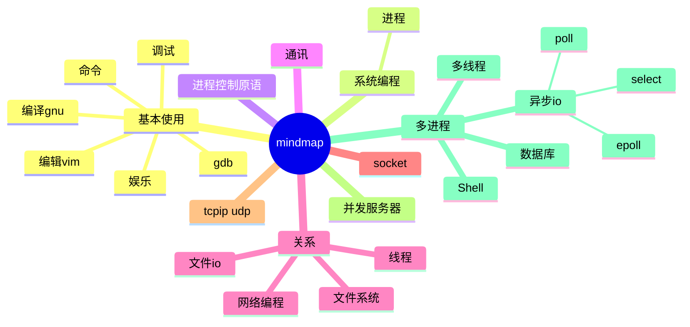

---
tags:
  - Linux
Dates: 2024-04-19
---
## 系统概述




## 文件系统id))I am a bang((

	- / 根目录
	- /bin
		- 系统二进制文件，ls、tar、mv、cat等
	- /sbin /usr/sbin /usr/local/sbin
		- 系统管理员命令
	- usr 应用程序存放目录
		- /usr/bin 
			- 应用程序
		- /usr/share
			- 共享数据
		- /usr/lib
			- 库函数文件（无法直接运行的文件）
		- /usr/local
			- 软件升级包
		- 。。。
		
	- /boot
		- 系统启动相关文件
	- /dev
		- 设备文件，如光驱等
	- /etc 
		- 系统配置文件			
	- /home
	- /lib
	- /mnt /media
	- /opt
	- /proc
	- /root


## 用户、权限管理 chmod
```
u4  g2  o1    a(all)
rwxrwxrwx
chmod u+x test.txt
chmod u=rxw,g=rwx,o=rwx fslk.f
chmod a= dd.py(删除权限)
chmod 777 1.dsd
```
### 查看当前用户whoami

### useradd passwd su
```
sudo useradd yangxiangnan -m -d /home/yangxiangna
```

