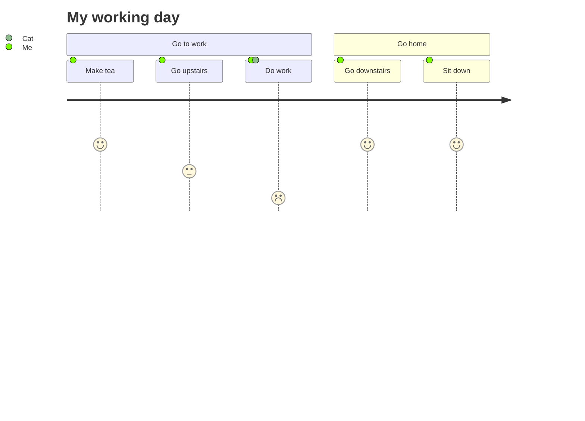

%% [ toc ] 不支持 %%

# 1、 标题

## h2
### h3
#### h4

# 2、粗体和斜体 
## 2.1 斜
*askjbfjka* == _dkajshfajl_

## 2.2 粗
**kjqbdjk**

## 2.3 斜粗体
**_laskjdl_** or *___laskjdl__* 前后各3字符对称拼接

## 小结
*和 _可以无缝替换

# 3、分割符 、文本删除线、文本下划线

## 3.1 分割符
## 3.2 文本删除线
## 3.3 文本下划线
`3个*或者-组成`

---
___

***

~~aksjdh~~

# 4、引用 
两个enter切换引用段落
>123
>1233

>abc

嵌套引用

>wqwe
>>qwe
>>sdhaj
>>>jkgk

# 5、 序列 

## 5.1、有序序列
1. 123
2. 24
	sqasdasd 这里要空一格
3. 34

## 5.2、无序序列 

- 123
- 234
- sdf

* 12
* 12

插入另一种元素 用四个空格 

+ qwd
    qwdqd
+ asd
+ da
+ 
 8个空格代码块 
+ qwd
        #cinclaksndfalksnd
+ asd
+ da

# 7、代码  

`
#include <stdio.h>
`

<u> dkjhasdkj </u>

# url链接

[显示名](url "title")
  

# 图片链接

## 给图片增加链接

## 11、任务列表

- [x] asfsaf
- [ ] asdfa

## 12、表格

| 行/列 | 列名  | 列名  |
| --: | --- | --- |
|  行名 |     | c   |

 ｜元素｜语法｜

｜标题｜#

  

| Syntax      | Description |  

| ---------- | ------------------ |  

| Header      | Title       |  

| Paragraph   | Text        | 

## 13 callout

> [!info]
> bckjzsbk
> azsxnc

> [!note]
> czxc
> zxcvz

> [!tip] asfsdf
> asfa

> [!faq]- dddd
> akjsnlanlaksnfdlkasndklasndlk

![[WechatIMG32.jpg]]