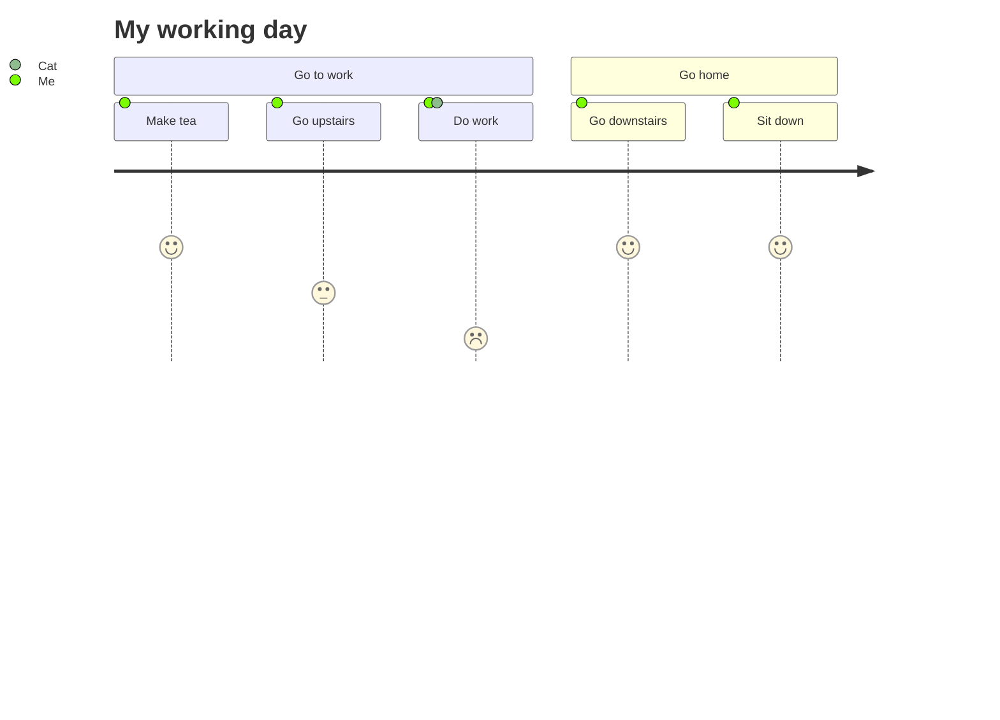

%% [ toc ] 不支持 %%

# 1、 标题

## h2
### h3
#### h4

# 2、粗体和斜体 
## 2.1 斜
*askjbfjka* == _dkajshfajl_

## 2.2 粗
**kjqbdjk**

## 2.3 斜粗体
**_laskjdl_** or *___laskjdl__* 前后各3字符对称拼接

## 小结
*和 _可以无缝替换

# 3、分割符 、文本删除线、文本下划线

## 3.1 分割符
## 3.2 文本删除线
## 3.3 文本下划线
`3个*或者-组成`

---
___

***

~~aksjdh~~


# 4、引用 
两个enter切换引用段落
>123
>1233

>abc

嵌套引用

>wqwe
>>qwe
>>sdhaj
>>>jkgk

# 5、 序列 

## 5.1、有序序列
1. 123
2. 24
	sqasdasd 这里要空一格
3. 34


## 5.2、无序序列 

- 123
- 234
- sdf

* 12
* 12

插入另一种元素 用四个空格 

+ qwd
    qwdqd
+ asd
+ da
+ 
 8个空格代码块 
+ qwd
        #cinclaksndfalksnd
+ asd
+ da


# 7、代码  
## 7.1行内代码（也可作为着重标记）
`#include <stdio.h>`
## 7.2 代码块
```html


```

```css

.box {
    width: 600px;
    height: 400px;
    margin: 100px auto;
    background-image: linear-gradient(black 33.3%,red 33.3%, red 66.6%, yellow 66.6%, yellow);
}   

```


```js
    // 定义一个30个整数的数组，按顺序分别赋予从2开始的偶数；然后按顺序每五个数求出一个平均值，放在另一个数组中并输出。试编程
    let arr = [2, 4, 6, 8, 10, 12, 14, 16, 18, 20, 22, 24, 26, 28, 30, 32, 34, 36, 38, 40, 42, 44, 46, 48, 50, 52, 54, 56, 58, 60]
    let newarr = [];
    for (let i = 0, count = 0, sum = 0, len = arr.length; i < len; i++) {
        sum += arr.shift();
        count++;
        if (count % 5 === 0) {
            newarr.push(sum / 5);
            sum =  0;
        }
    }
    console.log(newarr);

    let arr = [2, 4, 6, 8, 10, 12, 14, 16, 18, 20, 22, 24, 26, 28, 30, 32, 34, 36, 38, 40, 42, 44, 46, 48, 50, 52, 54, 56, 58, 60]
    let newarr = [];
    for (let i = 0, len = arr.length; i < len / 5; i++) {
        let subarr = arr.splice(0, 5)
        for (let j = 0, sum = 0; j < subarr.length; j++) {
            sum += subarr[j];
        }
        newarr.push(sum / 5);
    }
    console.log(newarr);
```

<u> dkjhasdkj </u>

# url链接

[显示名](url "title")
  

# 图片链接


## 给图片增加链接


[](https://markdown.com.cn)


## 11、任务列表

- [x] asfsaf
- [ ] asdfa


## 12、表格

- Markdown的表格，比HTML简单很多
- **|** 是构成表格的主要 **框架**
- **-** 区分 **表头** 和 **表格主体**
- **:** 控制 表格内 **文本内容** 的 **对齐方式**

| 行/列 | 列名  | 列名  |
| :--: | --- | --- |
|  行名 |   | c   |

%% 换行 %%
| Syntax      | Description |  
| ----------  | ----------- |  
| Header      | Title       |  
| Paragraph   | Text alskhdflasjdlaMM<br>akjshclasclkasck       | 


## 13 callout

> [!info]
> bckjzsbk
> azsxnc

> [!note]
> czxc
> zxcvz

> [!tip] asfsdf
> asfa


> [!faq]- dddd
> akjsnlanlaksnfdlkasndklasndlk




![[WechatIMG32.jpg]]