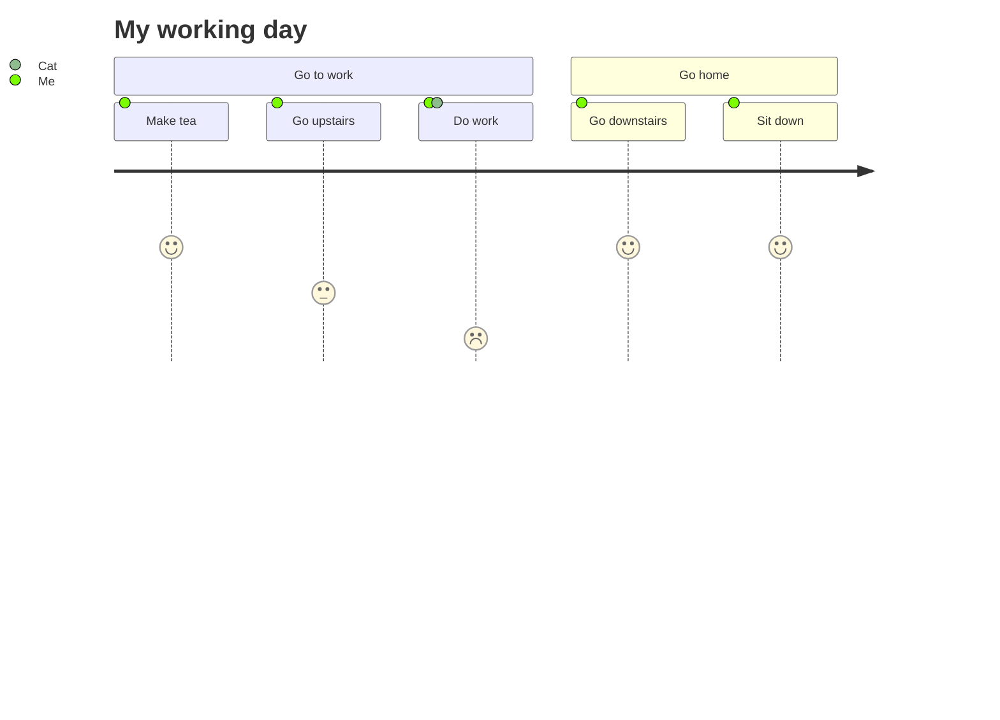

## 1、标题 

```
#
##

```
## 2、段落 


## 3、文字样式
加粗. 
	**123**
	**123**
斜体
	*456*
	_456_
	cmd+i
	*456
	

 ## 4、引用 
两个enter切换引用段落
>123
>1233

>abc

嵌套引用

>wqwe
>>qwe
>>sdhaj
>>jkgk
>


## 5、列表

1. asd
2. sd

+ adsf
+ asd
+ asd

- asd
	- asdas
- asfs
- sdf
- 


## 6、代码块

`asfsd`

```
hellwodmalsknflsajdz
lzxfnnlszksn
dznslxfn
```

## 7、分割线和删除线
___

***

---

~~asfbakj~~sknflsan

## 8、链接

[百毒](http://www.baidu.com )

[markdown链接](http://asfbjjksfjas.com  "titlelehfs")

## 9、网址 email
<aj@gmail.com>

## 10、图片


## 11、任务列表

- [x] asfsaf
- [ ] asdfa

 
## 12、表格

| 行/列 | 列名  | 列名  |
| --: | --- | --- |
|  行名 |     | c   |


## 13 callout

> [!info]
> bckjzsbk
> azsxnc

> [!note]
> czxc
> zxcvz

> [!tip] asfsdf
> asfa


> [!faq]- dddd
> akjsnlanlaksnfdlkasndklasndlk




![[WechatIMG32.jpg]]